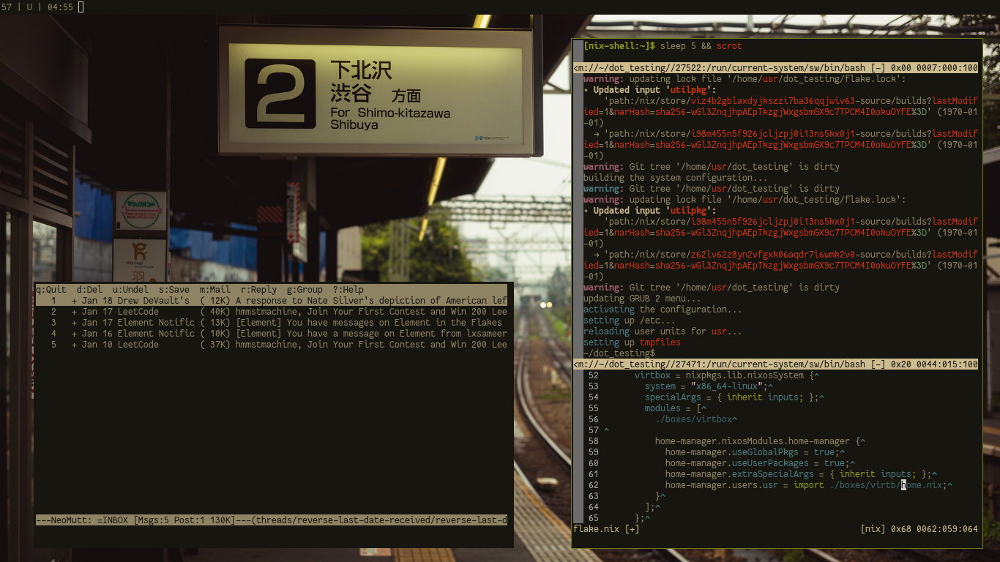

randomuser's dotfiles
=====================

features
--------

- `bspwm` + `sxhkd` + `st` + `firefox`
- most everything on the desktop save for the browser, media viewers, and desktop background, is a terminal
- on the server, runs gitea + simple-nixos-mailserver
- built with NixOS flakes

installation
------------

`sudo nixos-rebuild --flake .#your-flake-name-here switch`

if you're trying to install `netbox`, then use the `--impure` flag:

`sudo nixos-rebuild --flake .#netbox switch --impure`

for alternate installations on non-NixOS hosts, a Makefile will be made available

things to do
------------

- integrate `disko` and `sops-nix` into the setup
- establish backup infrastructure for `netbox`
- move gmail-mail-bridge into mail-sync repo
  * (perhaps figure out how to produce a flake for it)

license
-------

all materials, except `./home/wallpapers/pape.jpg`, is licensed under the GPLv3. the licensing status of `pape.jpg` is unknown.
